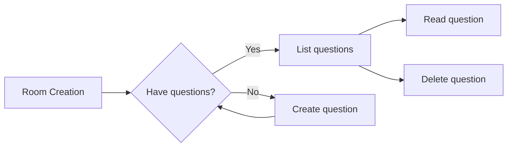

# Graph Questions

## About the project 📜
Q&A Api, and can

- Create Rooms
- Create questions for a specific room
- Delete and read questions

And is builded with:

- Node.js
- Prisma ORM
- Graphql
- Docker-Compose


## Installing the project 📦

Prerequisites:

- [Node.js](https://nodejs.org/en/)
- [Docker](https://docs.docker.com/get-started/)
- [Docker-Compose](https://docs.docker.com/compose/)

Clone the repository to your local machine:

With Https:

```bash
git clone https://github.com/jpbrab0/graph-questions.git
```

With SSH:

```bash
git clone git@github.com:jpbrab0/graph-questions.git
```

With Github CLI:

```bash
gh repo clone jpbrab0/graph-questions
```


## Running the project 🏃

Starting Docker-Compose
1. Install all dependencies of the project with npm:

- `npm i`

2. Setting up the database:

- `docker-compose up -d`

	`docker-compose start`

3. Rename the .exemple.env to .env
- `mv .exemple.env .env`

4. Running migrations:
- `npx prisma reset`

5. Initialize the server:

- `npm start`

---

## Graphql calls
Url: [http://localhost:4000](http://localhost:4000)

### Get Room By Id
```graphql
query GET_ROOM($id: ID!) {
    getRoomInfo(id: $id){
        id
        name
        password
        questions {
            id
            question
            read
        }
    }
}
```

| Parameter | Type   |
| :-------- | :----- |
| `id`      | ID! |

### Create Room
```graphql
mutation CREATE_ROOM($name: String!, $password: String) {
    createRoom(data: {name: $name, password: $password})
}
```
| Parameter | Type   |
| :-------- | :----- |
| `name`      | `String!` |
| `password`      | `String` |


### Delete room
```graphql
mutation DELETE_ROOM($id: ID!) {
    deleteRoom(id: $id)
}
```
| Parameter | Type   |
| :-------- | :----- |
| `id`      | `ID!` |

### Create Question
```graphql
mutation CREATE_QUESTION($question: String!, $roomId: ID!) {
  createQuestion(question: $question, roomId: $roomId)
}
```
| Parameter | Type   |
| :-------- | :----- |
| `question`      | `String!` |
| `roomId`      | `ID!` |

### Read Question
```graphql
mutation READ_QUESTION($id: ID!) {
  readQuestion(id: $id)
}
```
| Parameter | Type   |
| :-------- | :----- |
| `id`      | `ID!` |

### Delete Question
```graphql
mutation DELETE_QUESTION($id: ID!) {
  deleteQuestion(id: $id)
}
```
| Parameter | Type   |
| :-------- | :----- |
| `id`      | `ID!` |
---
## Api Workflow

---
Made by [jpbrab0](https://github.com/jpbrab0)